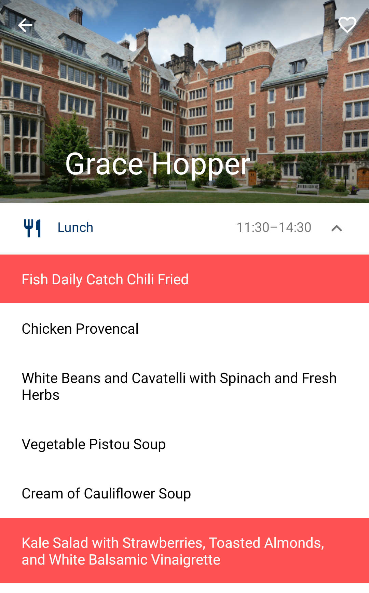

# Yale Menus (formerly Yale Dining Plus)
> Android version of the best student-made app for dining at Yale.

This app was created to replace the [official Yale Dining app](https://play.google.com/store/apps/details?id=org.yaledining.app) on Android, which was unpleasant to use due to outdated graphics, usability issues, and several recurring bugs. It provided a cleaner and better-designed interface to Yale Dining data, including new features such as the ability to set a dining hall as an auto-opening favorite, marking menu items as favorites to be notified when they're served, and setting up visual warnings when a recipe violates your dietary restrictions.

During Summer 2020, Yale Dining removed the iOS and Android versions of their dining apps, and replaced their API with a human-facing website. [YaleDine](https://yaledine.com) was created to develop a scraping-based solution to replace the official API with a new one that was better designed. Subsequently, this app was rebuilt to rely on the new YaleDine API. At the same time, this version of the app was rebranded to Yale Menus, in order to act as an Android parallel to the existing [Yale Menus iOS app](https://github.com/YaleMenus/ios).

## Features
Yale Menus for Android contains several useful features not included in the original app.

### Main menu
The dining halls in the main menu are sorted by their distance to the user's location, in addition to displaying their occupancy and open/closed status like the original app.

### Menu page
The menu page for each dining hall displays the menus for each meal being served in the dining hall for that day, and includes an option to favorite the dining hall. If the hall has already stopped serving a meal, it is excluded from the list.

### Nutrition info
The item detail page displays all the nutritional information for a menu item. The page also contains a button that allows the user to follow a menu item. The app uses Android's JobService API to periodically update the dining hall menus in the background, and send the user a notification if a followed item is being served in a dining hall.

 

### Dietary preferences
The user has the ability to indicate dietary traits that they want to avoid. The app then uses this information to highlight menu items on the menu page that contain these traits, making it easier for the user to see which dishes they should avoid.

 

## External libraries
[CircleImageView](https://github.com/hdodenhof/CircleImageView)
[Firebase Job Dispatcher](https://github.com/firebase/firebase-jobdispatcher-android)

## Contributors
This application was created by [Adisa Malik](https://adisamalik.com) for his 2017 senior thesis. It is maintained by [Erik Boesen](https://github.com/ErikBoesen).
